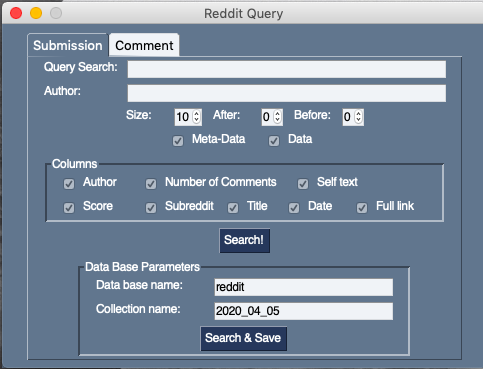

# Scrappers - Twitter, Reddit, Instagram
A unified basic parameters scrapper platform to scrape data from platforms and store in mongoDB database for further processing.

## External awesome libraries
* **Twitter** - twitter scraper library - [Twint Project](https://github.com/twintproject/twint)
* **Reddit** - pushshift Reddit API - [Pushshift Reddit API](https://github.com/pushshift/api)
* **Instagram** - InstaLooter scraper - [InstaLooter](https://github.com/althonos/InstaLooter)
* **GUI** - using the PySimpleGUI library - [PySimpleGUI](https://pysimplegui.readthedocs.io/en/latest/)

## Description
This project created to exprience and test some scrapring techniques for further use in other projects.
Currently each scrapper has its own GUI extension for simple usage.

### Current Version
- [x] Twitter + GUI
- [x] Reddit + GUI
- [x] Instagram + GUI

## Examples
### Twitter query GUI

This is the twitter query window it allows some basic paramters be inputed for search:
- **Search query** - the string for the search query to be searched.
- **Languge** - what language of the tweets requested.
- **No. of tweets** - set the number of tweets in the request.
- **Start/End date** - limit the date search.

After deciding on the query there are 2 options:
1. Make the search and see the output.
2. Make the search and save the results in the monogDB based on the parameters inputed in the 2 fields.

### Reddit query GUI
#### Submission tab

The submission tab in the Reddit query let the user choose number of paramters for submission search.
- **Query search** - the string to pass for serach.
- **Author** - serach by author name.
- **Size** - number of reddits results.
- **After/Before** - how many days from the serach query after/before date to search.
- **Meta-Data** -  summary of the results.
- **Data** - data result.
Columns area:
The data that the user wishes to be extracted from each query answer.

As in the twitter query window the user have option to **search** or **search and save** to mongoDB.

#### Comment tab

This comment tab lets the user search for comments contains the query string.
The submission tab in the Reddit query let the user choose number of paramters for submission search.
- **Query search** - the string to pass for serach.
- **Author** - serach by author name.
- **Size** - number of reddits results.
- **After/Before** - how many days from the serach query after/before date to search.
- **Meta-Data** -  summary of the results.
- **Data** - data result.
Columns area:
The data that the user wishes to be extracted from each query answer.

As in the twitter query window the user have option to **search** or **search and save** to mongoDB.

### Instagram query GUI

Using this query window the user can make query about Hashtag or specific user name and retrieve specified number of pictures and meta-data. All the pictures stored localy and the meta-data in the mongoDB local server.

- **Hashtag** - hashtag query.
- **User name** - user name query.
- **Num of pic** - limit the number of pictures to retrieve.
- **Meta-Data & pictures** - check boxs for the user to choose which data to save.

## Authors
This simple usage of libraries written by:
- Or Shalit - [@orshalit](https://github.com/orshalit)
- Alla Kitaieva - [@AllaKit](https://github.com/AllaKit)  
- Tzvi Puchinsky (also this readme author) - [@Tzvi23](https://github.com/Tzvi23)
